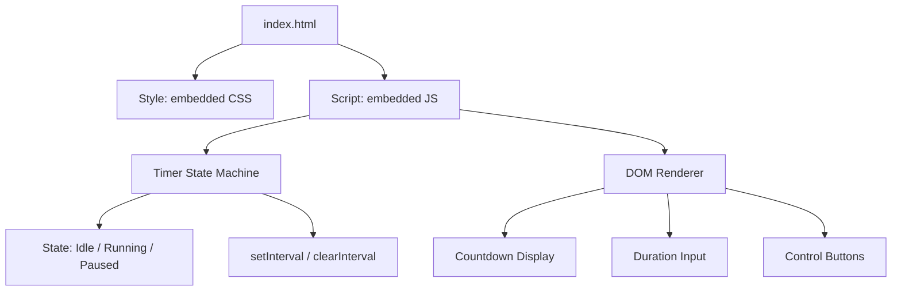
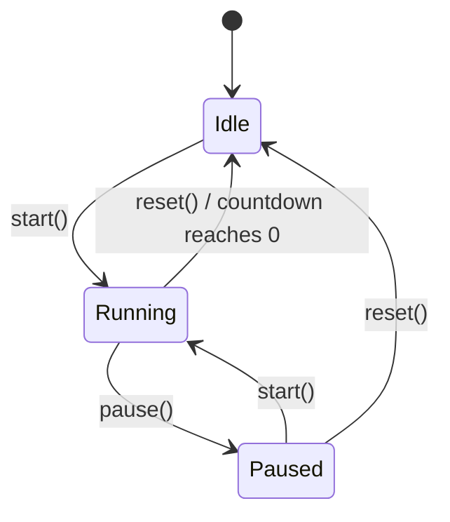

# Design Document: Focus Timer

## Overview

The Focus Timer is a simple, static web application that provides a countdown timer for focus/work sessions. It consists of a single HTML page with embedded CSS and JavaScript — no build tools, frameworks, or server-side components. The app manages a finite state machine with three states (Idle, Running, Paused) and exposes Start, Pause, and Reset controls alongside a configurable duration input.

The design prioritizes simplicity: vanilla HTML/CSS/JS, no dependencies, and a clean architecture that separates timer logic from DOM rendering.

## Architecture

The app follows a straightforward single-page architecture:



**Key architectural decisions:**

1. **No framework** — The app is simple enough that vanilla JS with a state machine pattern is sufficient. This keeps the deployment as a single HTML file (or a small set of static files).
2. **State machine pattern** — Timer behavior is governed by an explicit state variable (`idle`, `running`, `paused`) that determines which controls are enabled and how the display updates.
3. **`setInterval` for ticking** — A 1-second interval drives the countdown during `running` state. The interval is cleared on pause/reset/completion.

## Components and Interfaces

### 1. Timer State Machine (`timerState`)

Manages the core timer logic independent of the DOM.

```typescript
// Conceptual interface (implemented in plain JS)
interface TimerState {
  status: 'idle' | 'running' | 'paused';
  durationMinutes: number;     // configured duration (1–120)
  remainingSeconds: number;    // seconds left on the countdown
}

// Actions
function start(state: TimerState): TimerState;
function pause(state: TimerState): TimerState;
function reset(state: TimerState): TimerState;
function tick(state: TimerState): TimerState;
function setDuration(state: TimerState, minutes: number): TimerState;
```

**State transitions:**



### 2. DOM Renderer

Reads the current `TimerState` and updates the DOM accordingly:

- Updates the countdown display text (`MM:SS` format)
- Enables/disables buttons based on state
- Locks/unlocks the duration input based on state

### 3. Duration Input Handler

- Validates user input (whole numbers, 1–120 range)
- Rejects invalid values and retains the previous valid duration
- Only accepts changes while in Idle state

### 4. Interval Controller

- Starts a `setInterval(tick, 1000)` when entering Running state
- Clears the interval when leaving Running state (pause, reset, or completion)

## Data Models

### TimerState

| Field | Type | Constraints | Description |
|-------|------|-------------|-------------|
| `status` | `string` | `'idle' \| 'running' \| 'paused'` | Current state of the timer |
| `durationMinutes` | `number` | Integer, 1–120 | Configured session length |
| `remainingSeconds` | `number` | Integer, 0–7200 | Seconds remaining in countdown |

### Derived Values

| Value | Derivation | Description |
|-------|-----------|-------------|
| `displayMinutes` | `Math.floor(remainingSeconds / 60)` | Minutes portion for display |
| `displaySeconds` | `remainingSeconds % 60` | Seconds portion for display |
| `formattedTime` | `MM:SS` zero-padded | The string shown in the countdown |

### Button States (derived from `status`)

| State | Start | Pause | Reset | Duration Input |
|-------|-------|-------|-------|----------------|
| Idle | Enabled | Disabled | Disabled | Editable |
| Running | Disabled | Enabled | Enabled | Locked |
| Paused | Enabled | Disabled | Enabled | Locked |

## Correctness Properties

*A property is a characteristic or behavior that should hold true across all valid executions of a system — essentially, a formal statement about what the system should do. Properties serve as the bridge between human-readable specifications and machine-verifiable correctness guarantees.*

### Property 1: Time formatting produces valid MM:SS

*For any* integer `remainingSeconds` in the range 0–7200, the format function SHALL produce a string matching the pattern `DD:DD` where the minutes portion equals `Math.floor(remainingSeconds / 60)` zero-padded to 2 digits, and the seconds portion equals `remainingSeconds % 60` zero-padded to 2 digits.

**Validates: Requirements 1.1**

### Property 2: Tick in running state decrements and completes

*For any* TimerState with status `'running'` and `remainingSeconds > 0`, calling `tick()` SHALL return a state where `remainingSeconds` is exactly 1 less than before. If the resulting `remainingSeconds` equals 0, the returned status SHALL be `'idle'`.

**Validates: Requirements 1.2, 6.1, 6.2**

### Property 3: Tick in non-running state is a no-op

*For any* TimerState with status `'idle'` or `'paused'`, calling `tick()` SHALL return a state identical to the input state (no fields changed).

**Validates: Requirements 1.4**

### Property 4: Duration validation accepts valid and rejects invalid

*For any* numeric value, the duration validation function SHALL accept the value if and only if it is a whole number in the range 1–120 (inclusive). For any value outside this range or any non-integer, the validation SHALL reject it.

**Validates: Requirements 2.1, 2.7**

### Property 5: setDuration in idle state synchronizes remainingSeconds

*For any* TimerState with status `'idle'` and any valid duration value (integer 1–120), calling `setDuration(minutes)` SHALL update `durationMinutes` to the new value and set `remainingSeconds` to `minutes * 60`.

**Validates: Requirements 1.3, 2.6**

### Property 6: Start transitions to running preserving time

*For any* TimerState with status `'idle'` or `'paused'`, calling `start()` SHALL return a state with status `'running'` and `remainingSeconds` unchanged from the input state.

**Validates: Requirements 3.1, 3.2**

### Property 7: Pause preserves remaining time

*For any* TimerState with status `'running'`, calling `pause()` SHALL return a state with status `'paused'` and `remainingSeconds` identical to the input state.

**Validates: Requirements 4.1**

### Property 8: Reset restores idle with full duration

*For any* TimerState with status `'running'` or `'paused'`, calling `reset()` SHALL return a state with status `'idle'` and `remainingSeconds` equal to `durationMinutes * 60`.

**Validates: Requirements 5.1, 5.2**

## Error Handling

| Scenario | Handling |
|----------|----------|
| Invalid duration input (non-integer, out of range) | Reject the value silently; retain previous valid duration. No error message required. |
| Start pressed while already running | Button is disabled; no state change. |
| Pause pressed while idle or paused | Button is disabled; no state change. |
| Reset pressed while idle | Button is disabled; no state change. |
| Timer reaches zero | Automatic transition to idle; no error state. |
| Browser tab loses focus during countdown | `setInterval` continues in background (standard browser behavior). Timer remains accurate. |

No crash-level errors are expected since the app is purely client-side with no network calls or persistent storage.

## Testing Strategy

### Property-Based Tests (fast-check)

The timer state machine logic is well-suited for property-based testing because:
- State transitions are pure functions with clear input/output
- The input space (various timer states × actions) is large
- Universal properties hold across all valid states

**Library:** [fast-check](https://github.com/dubzzz/fast-check) (JavaScript PBT library)

**Configuration:**
- Minimum 100 iterations per property
- Each test tagged with: `Feature: focus-timer, Property {N}: {description}`

**Properties to implement:**
1. Time formatting (Property 1)
2. Tick decrement and completion (Property 2)
3. Tick no-op in non-running states (Property 3)
4. Duration validation (Property 4)
5. setDuration synchronization (Property 5)
6. Start transitions (Property 6)
7. Pause preservation (Property 7)
8. Reset restoration (Property 8)

### Unit Tests (example-based)

- Initial state defaults to 25 minutes (Req 2.2)
- Button enabled/disabled states match the state table (Req 3.3, 4.2, 4.3, 4.4, 5.3)
- Duration input editability per state (Req 2.3, 2.4, 2.5)
- Start rejected when duration < 1 (Req 3.4)
- Completion makes input editable (Req 6.3)

### Integration Tests

- Reset clears the interval within 100ms (Req 5.4)
- Countdown ticks at ~1 second intervals using real timers

### Test Runner

**Vitest** — lightweight, fast, works well with vanilla JS projects and fast-check. Run with `vitest --run` for single execution.

